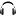

---
title: "Asset Manager"
---

## 🔸Overview

<figure>
  
  <figcaption>Along with textures and audio, your source code is also considered assets! </figcaption>
</figure>

1️⃣. Each tab along the top independently manages a different type of asset:

-  **Code:** Your C++ source code files and builds.
-  **Atlases:** Imported and generated image files combined into texture atlases.
-  **Audio:** Sound files, including music and sound effects.  

!!! info inline end "Code Assets"
    Code assets do not use **Banks**. They instead make **Builds**, which are entirely different and explained in the [Build Settings](#build-settings) section.  
2️⃣. Banks are used to group assets that are likely to be used together. Examples would be grouping assets by game level, or by type (e.g., UI sounds vs. gameplay sounds).

- More information can be found in the [Banks](#banks) section

3️⃣. Along the bottom are the tool buttons that allow you to manage your assets:
=== " Code"
    - : Add a new C++ class.
    - : Create new filter, which is essentially a folder to organize your images within a bank.
    - : Import already existing code files from a single directory.
    - : Import already existing code files from a directory and its subdirectories.
    - : Replace selected images by selecting the same number of new assets.
    - : Delete selected images
    !!! warning
        These actions do not use an undo/redo system

=== " Atlases"
    - : Create new filter, which is essentially a folder to organize your images within a bank.
    - : Import specified PNG image files from a single directory.
    - : Import all PNG image files from a directory and its subdirectories.
    - : Replace selected images by selecting the same number of new assets.
    - : Delete selected images
    !!! warning
        These actions do not use an undo/redo system

=== " Audio"
    - : Create new filter, which is essentially a folder to organize your sounds within a bank.
    - : Import specified WAV sound files from a single directory.
    - : Import all WAV sound files from a directory and its subdirectories.
    - : Replace selected sound WAVs by selecting the same number of new assets.
    - : Delete selected sounds
    !!! warning
        These actions do not use an undo/redo system

## 🔸Assets
The assets and filters are shown in the main tree view:

- You can multi-select and drag 'n drop them to new locations.  
- Double ++left-button++ an asset will preview it in the **Asset Inspector**, located in the Auxiliary window.  
- ++right-button++ an asset will open a context menu with additional options, such as renaming, moving to a different bank, or setting [Asset Properties](#asset-properties).
- ++right-button++ an asset and selecting **Asset Properties** will open the **Asset Properties** dialog.

## 🔸Banks

<figure>
  
  <figcaption>Right-click context menu for an asset</figcaption>
</figure>

## 🔸Code & Build Management

When you select the **Code** tab in the **Asset Manager**, you'll see a list of your game's C++ source code files. These files are organized into **Builds**, which are configurations that determine how your code is compiled and linked.

### Build Settings

With the desired **Project** active, you can open the **Build Settings** in the menu `Project > Build Settings`

**Output Name** is the name of the final executable file created when building your game.

Below that you can choose which 3rd party vendors Harmony will use if you have a preference. The **Extras** require you to manually install them in the respective `HarmonyEngine/Engine/extras/` directory. Follow the instructions in the `README.txt` file included in each extra's folder.

### Adding Additional Library Dependencies

If you need certain code libraries/dependencies to be included in your build click the  **Add library dependency** button.

<figure>
  
  <figcaption>Example of the cURL library as a dependency</figcaption>
</figure>

The library dependency must be a CMake compatible package. You must specify the following two fields:

- **CMakeLists.txt Project Name**: The library target name used within the `add_library()` command.
- **Library relative location**: Use the "Browse..." button to select the folder where the library's root `CMakeLists.txt` is located

**Options** can be left blank, but is useful if you want to override default options or inject CMake scripting code. The options are parsed (and cached) before the library is included.

!!! note "After Adding Dependencies"
    If you already have an existing build, CMake may try to update the environment automatically after you try to compile. On occasion, CMake errors out and prints `setlocal` in the output, which may be resolved by deleting and recreating the build.

### Creating New Builds

With your **Build Settings** determined, you can create a new build of your game by selecting `Project > New Build` from the menu, or by pressing `Ctrl+Shift+B`.

Any existing source code is independent of your builds, so removing the **Project**'s `/build/` folder can be done freely. 
