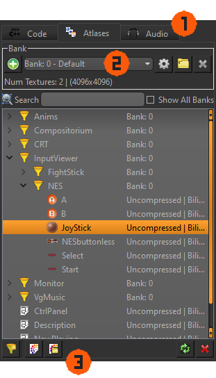
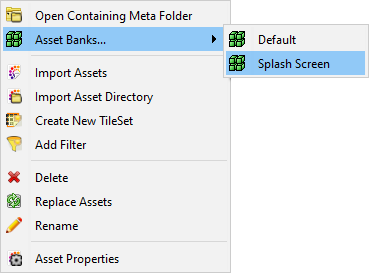
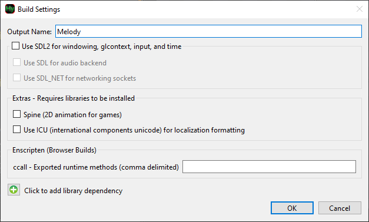
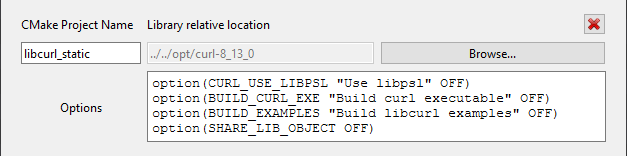

## Overview

The below example is for all asset types besides **Code**, which is covered below in the [Code & Build Management](#code-build-management) section.   

<figure>
  
  <figcaption>Your source code is also considered assets! Along with textures and audio. </figcaption>
</figure>

1. Each tab along the top independently manages a different type of asset:
    - **Code:** Your C++ source code files, including auto-generated [entity](./items/entity.md) classes
    - **Atlases:** Imported and generated image files combined into texture atlases
    - **Audio:** Sound files, including music and sound effects
2. Banks are used to group assets that are likely to be used together. Examples would be grouping assets by game level, or by type (e.g., UI sounds vs. gameplay sounds).
> Code assets do not use banks. They instead make **builds**, which are entirely different and explained in the [Build Settings](#build-settings) section.

3. Along the bottom are the tool buttons that allow you to manage your assets:
    - : Create new filter, which is essentially a folder to organize your assets within a bank.
    - : Import specified assets from a single directory.
    - : Import all assets from a directory and its subdirectories.
    - : Replace selected assets by selecting the same number of new assets.
    - : Delete selected assets
> These actions do not use an undo/redo system

4. The filters and assets are shown in a tree view:
    - You can multi-select and drag 'n drop them to new locations.  
    - Double-clicking an asset will preview it in the **Asset Inspector**, located in the Auxiliary window.  
    - Right-clicking an asset will open a context menu with additional options, such as renaming, moving to a different bank, or setting [Asset Properties](#asset-properties).

<figure>
  
  <figcaption>Right-click context menu for an asset</figcaption>
</figure>

## Asset Properties

Right-clicking an asset and selecting **Properties...** will open the **Asset Properties** dialog.

## Code & Build Management

When you select the **Code** tab in the **Asset Manager**, you'll see a list of your game's C++ source code files. These files are organized into **Builds**, which are configurations that determine how your code is compiled and linked.

### Build Settings

With the desired **Project** active, you can open the **Build Settings** in the menu `Project > Build Settings`

**Output Name** is the name of the final executable file created when building your game.

Below that you can choose which 3rd party vendors Harmony will use if you have a preference. The **Extras** require you to manually install them in the respective `HarmonyEngine/Engine/extras/` directory. Follow the instructions in the `README.txt` file included in each extra's folder.

### Adding Additional Library Dependencies

If you need certain code libraries/dependencies to be included in your build click the  **Add library dependency** button.

The library dependency must be a CMake compatible package. You must specify the following two fields:

- **CMakeLists.txt Project Name**: The library target name used within the `add_library()` command.
- **Library relative location**: Use the "Browse..." button to select the folder where the library's root `CMakeLists.txt` is located

**Options** can be left blank, but is useful if you want to override default options or inject CMake scripting code. The options are parsed (and cached) before the library is included.

> If you already have an existing compatible build, CMake may try to update the environment automatically when you try to compile. On occasion you may need to recreate your build after adding dependencies.

## Creating New Builds

With your **Build Settings** determined, you can create a new build of your game by selecting `Project > New Build` from the menu, or by pressing `Ctrl+Shift+B`.

Any existing source code is independent of your builds, so removing the **Project**'s `/build/` folder can be done freely. 
