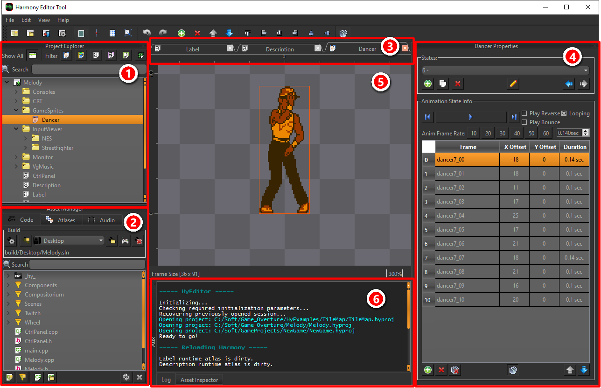
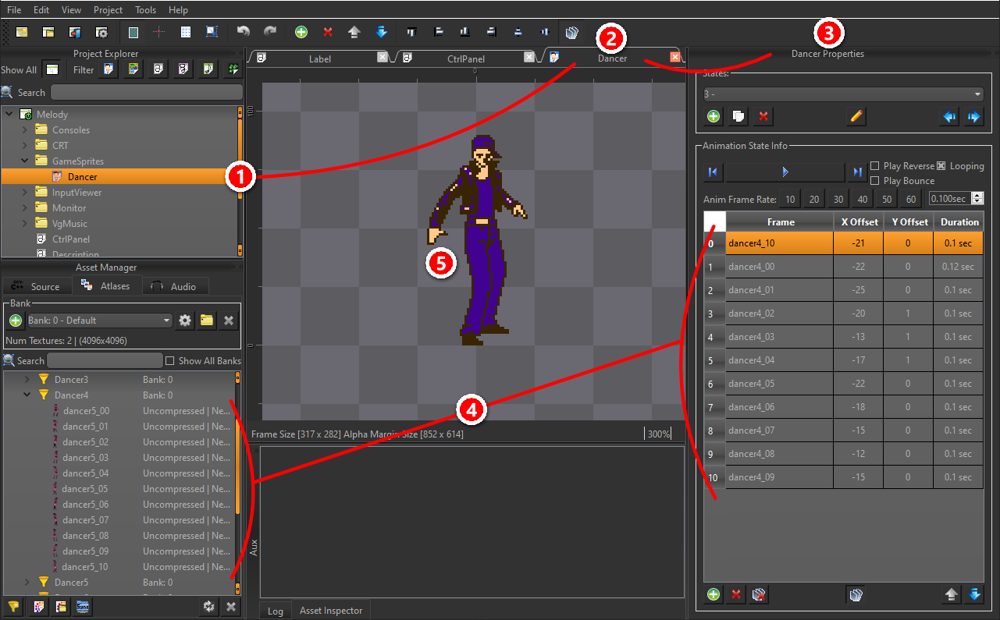

<figure>
  
  <figcaption>HyEditor's default window layout.</figcaption>
</figure>

<table style="border-collapse: collapse; border: none;">
    <tr style="border: none;">
        <td style="border: none; padding-right: 20px;"><strong>1. Project Explorer</strong> 
            Open <em>Project</em>'s will show up here. You may have multiple <em>Project</em>'s open and browsable at once, but only one <em>Project</em> may be 'active' at a given time. All the details are provided in the <a href="projects.html">Projects</a> section.
        </td>
        <td style="border: none; padding-right: 20px;"><strong>2. Asset Manager</strong> 
            The currently active <em>Project</em>'s <em>Asset Manager</em>. Each tab along the top are the major asset types handled independantly from each other. All the details are provided in the <a href="asset-manager.html">Asset Manager</a> section.
        </td>
    </tr>
    <tr style="border: none;">
        <td style="border: none; padding-right: 20px;"><strong>3. Project Tab Bar</strong> 
            All currently open <em>Project Item</em>'s from the active <em>Project</em> are shown here. You can cycle between them with <code>Ctrl+Tab</code> and each item has its own Undo/Redo stack.
        </td>
        <td style="border: none; padding-right: 20px;"><strong>4. Project Item Properties</strong> 
            Shows all the properties of the currently selected <em>Project Item</em> in the <em>Project Tab Bar</em>. The properties set here set are reflected in the <em>middle render window</em>.
        </td>
    </tr>
    <tr style="border: none;">
        <td style="border: none; padding-right: 20px;"><strong>5. Middle Render Window</strong> 
            The currently selected <em>Project Item</em> is previewed here. The renderer used here is the same renderer used in your game, <em>HyEngine</em>. Previews are created by simulating the same load process as well, so it's a WYSIWYG work-flow. Pan the view with <code>WASD</code> or <code>Middle Mouse</code>, and zoom with the <code>Mouse Wheel</code>.
        </td>
        <td style="border: none; padding-right: 20px;"><strong>6. Auxiliary Window</strong> 
            The Auxiliary window is contextually used when needed. By default it'll display logs, but when an additional window is needed by the <em>Asset Manager</em> or the <em>Project Item Properties</em>, a new tab along the bottom will appear and be shown. Its visibility can be toggled with <code>Ctrl+Space</code>.
        </td>
    </tr>
</table>

## ▶️Editor Flow

<figure>
  
  <figcaption>Shows how each section of HyEditor works together.</figcaption>
</figure>

1. Open a **Project Item** from **Project Explorer**...
2. Shows up in **Project Tab Bar**, and when selected...
3. It will be displayed in the **Project Item Properties** which...
4. May reference assets in **Asset Manager** to...
5. Show a preview in the **Middle Render Window**