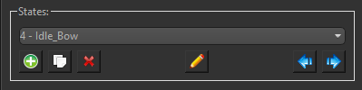
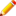
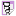
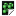

---
title: "🔶Project Items"
---

Project Items are the building blocks of your game. They are created and edited within the **HyEditor** and used to assemble the various scene nodes that make up your game world. There are several types of Project Items, each serving a specific purpose, but they also have common concepts that apply to all items.

## Creating new Project Items

Within the [Project Explorer](../projects.md#project-explorer), to create a new Item you can :material-mouse-right-click:++right-button++ in the tree view on a  prefix folder and select `New Item > [select item]` to create an item at that location, or use one of the following methods:

- `File > New Item > [select item]` from the top menu
- Press ++ctrl+n++, ++s++ to create a new  Sprite  
- Press ++ctrl+n++, ++t++ to create a new  Text  
- Press ++ctrl+n++, ++m++ to create a new  Tile Map  
- Press ++ctrl+n++, ++f++ to create a new  Particle FX  
- Press ++ctrl+n++, ++i++ to create a new  Spine  
- Press ++ctrl+n++, ++p++ to create a new  Prefab  
- Press ++ctrl+n++, ++a++ to create a new  Audio  
- Press ++ctrl+n++, ++e++ to create a new  Entity  

## Item States

Every Project Item utilizes the concept of 'states', regardless of which type it is. In the case of a sprite, this can be the different animations a character can do, like idle, walk, and jump. Or if the sprite is a framed painting wall decoration, each state could be a different piece of art. For a text item, each state might be the same font/style but at different sizes, or each state could be the font in regular, bold, and italic. Ultimately how you want to utilize the states for any given Project Item is up to you.

In every Project Item's Properties window, you will find the States Groupbox that looks like this:

{ align=left }

Within the example image's drop-down box, the "4" indicates which zero-based state index is currently selected, and "Idle_Bow" is the name given to the state. The names of states are only used on the Editor's side, and are accessed by index in code.

Add new "blank" states by pressing the  button, or append a duplicate of the currently selected state with the  button. Rename the state with , and arrange states by index with  and  buttons.

!!! tip "Widgets above and below the States Groupbox"
    In the Properties Window for each Project Item type, widgets placed above the States Groupbox generally affect the item overall, while widgets placed underneath the States Groupbox are properties that affect the currently selected state.

## Types

-   [ Sprite Items](./sprites.md)  
    

    ---
    Textured quads capable of displaying single images or animated spritesheets in 2D or 3D space.

-   [ Text Items](./text.md)

    ---
    Render bitmap fonts with various font styles, outlines, sizes, and gradient colors.

-   [ Tile Map Items](./tilemaps.md)  

    ---
    Efficiently design levels with a Tile Set that can be assembled using auto-tiling and a grid-based system with support for multiple layers and collision.

-   [ Particle FX Items](./particles.md)  

    ---
    Create and manage particle effects with various properties like lifetime, speed, and emission rate.

-   [ Spine Items](./spine.md)  
    

    ---
    Integrate 2D skeletal animations created with Spine, allowing for complex character animations with bones and meshes.

-   [ Prefab Items](./prefabs.md)  

    ---
    Import GLTF 3D models that can be inserted into your scene's 2D display order as orthographic or perspective 3D objects.

-   [ Audio Items](./audio.md)  
    
    ---
    Audio cues or background music tracks that can be attached to entities for positional sound or simply played within your scenes.

-   [ Entity Items](./entities.md)  
    

    ---
    Containers that can hold multiple child Item Nodes, allowing for hierarchical organization and transformation of grouped items. Entities can also animate their child nodes over time using Timelines.
  

