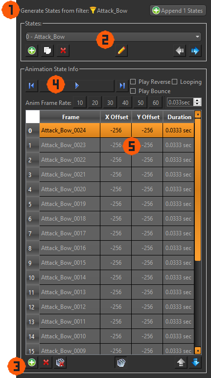
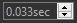
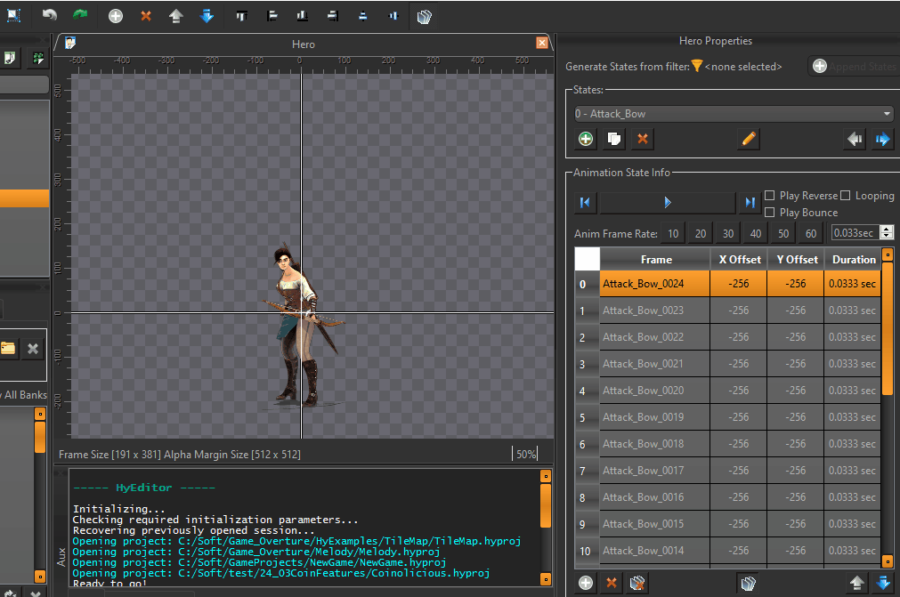

Sprite Items are used to display textured quads in 2D or 3D space. To get started with sprites, you need to have imported images into the **Atlases** section of the [Asset Manager](../asset-manager.md). Once you have your images imported, you can add them as frames to a state of the Sprite Item. Single frame sprites and animated sprites are created and used the same way. If this is an animated sprite with multiple frames, you can preview the animation using ++space++ which will play/pause the animation starting from the currently selected frame in the properties table.

## Property Widgets

 

- :material-numeric-1-circle:{.hyindicator}ㅤ**Generate States**  
  If your [Asset Manager](../asset-manager.md)'s  Atlas images are organized into  filters, you can quickly setup the sprite's various animations with a single button. Otherwise you can manually create states and add frames using :material-numeric-2-circle:{.hyorange} and :material-numeric-3-circle:{.hyorange} instead.
- :material-numeric-2-circle:{.hyindicator}ㅤ**Configure States**  
  Sprite states allow a sprite instance to show a different image or animation. All settings for the currently selected state are shown below the **States Groupbox**.
- :material-numeric-3-circle:{.hyindicator}ㅤ**Add/Remove Frames**  
  Add all the selected images within [Asset Manager](../asset-manager.md) to the currently selected state. The images become frames of animation and are inserted alphabetically, so it's ideal to have the images named with the frame index appended on the end.
- :material-numeric-4-circle:{.hyindicator}ㅤ**Animation Settings**  
  The **Anim Frame Rate** buttons are labeled in "Frames per second" and will apply to all frames in the current state. You can alternately use the  spin box which will directly specify the duration that each frame lasts in the animation. The three checkboxes determine in what order will the frames of animation play for the state. You can use the  button to preview how each checkbox affects the playback.
- :material-numeric-5-circle:{.hyindicator}ㅤ**Frame List**  
  The table here lists all the frames this state uses, and their attributes *Offset* and *Duration*. You can double :material-mouse-left-click:++left-button++ on an attribute to change it.

## Sprite Origin & Frame Offsets

The white origin (or pivot point) in the center render window is the point around which the sprite will position, rotate, and scale its frames in the game. By default, any newly added frames start centered at the origin, but you can change it by adjusting the *Offset* values for each frame in the frame list.

To more easily set the *Offset* for the frames, you can use any of the alignment buttons located above the frame list, or :material-mouse-left-click:++left-button++ on the preview and drag the frame in the Middle Render Window.

Sprites have a unique checkable 'apply to all'  button. By default it starts *checked*, and applys any *Offset* to all frames in the current state. If you uncheck it, any *Offset* changes will only apply to the currently selected frame in the list.

