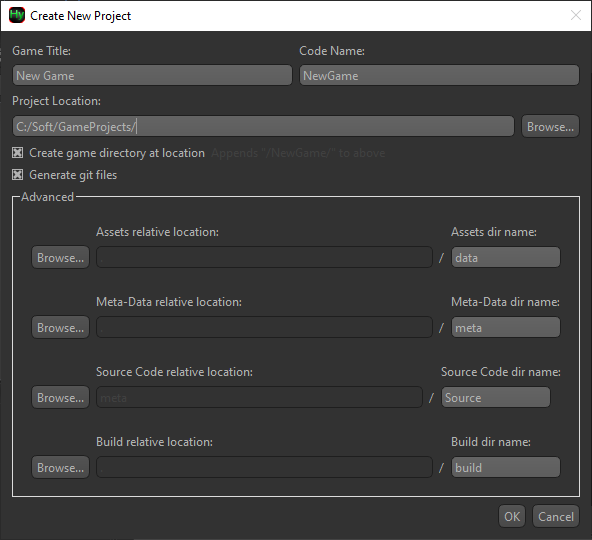
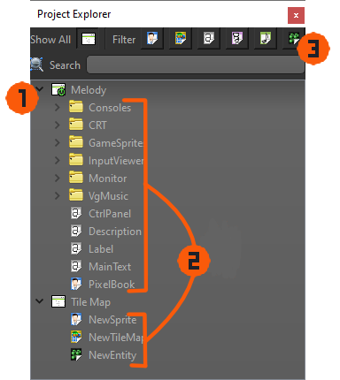
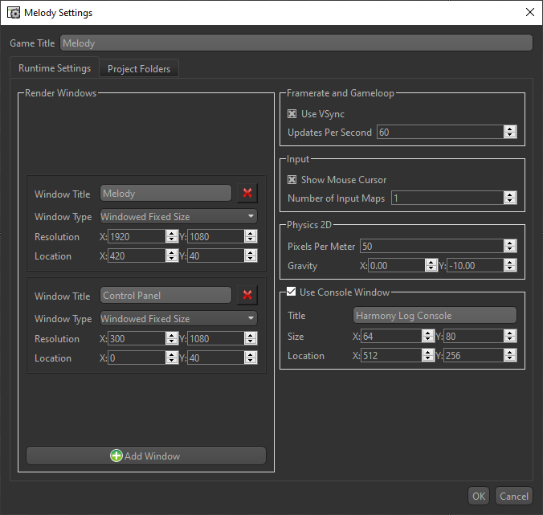
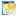
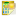
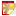
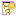
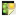

---
title: "Projects"
---

## Creating a new Project

To create a new Project in the Project Explorer you can:

- Click the  button along the top tool bar
- `File > New Project` from the menu
- Press ++ctrl+shift+n++

<figure>
  
  <figcaption></figcaption>
</figure>

- **Game Title** is the human readable name of your game, used on labels and titles.
- **Code Name** will be used to create the main C++ class, and must be compliant with standard naming conventions.
- The final **Project Location** (where all the project files will be dumped) is assembled by what's specified in the text field PLUS whether **Create game directory at location** is checked.
- Within **Advanced** you can customize how the project folders (like the assets or source code) reside and what they're named. You can even specify locations outside the **Project Location**. For each entry, press **Browse...** and choose the desired *parent* location, and the relative path from the **Project Location** will be filled in. Finally enter the name of the directory itself.

!!! note "Example Setup"
    If you want a common location for multiple game projects, specify that root location the text field and keep **Create game directory at location** checked.

## Project Explorer

<figure>
  
  <figcaption>Folders within <strong>Project Explorer</strong> are often referred as <em>Prefixes</em>.</figcaption>
</figure>

- :material-numeric-1-circle:{.hyindicator}ㅤAll currently open **Project**s  are shown in the tree view here. Nested beneath each **Project** are the prefix folders containing the **Project Items**. The currently active project is shown with the  sub-icon.  
- :material-numeric-2-circle:{.hyindicator}ㅤYou can drag **Project Items** between entirely different game **Projects** to copy them. This will include importing any required assets into the target project.  
- :material-numeric-3-circle:{.hyindicator}ㅤThe search box allows you to filter the visible **Project Items** in the tree view. You can also filter by item type by selecting the corresponding icon.

## Project Settings

Click the  button along the top tool bar, or :material-mouse-right-click:++right-button++ on a Project within [Project Explorer](#project-explorer) and select " Project Settings" to open the Project Settings dialog.

<figure>
  
  <figcaption>Dialog tool meant to edit the game's .hyproj file</figcaption>
</figure>

- **Render Windows**  
Most games will only need one window, but if your program requires multiple windows, you can add them here. Each window can have its own Title, Resolution, resize-ability, and starting location. When accessing these windows in code, they are referenced by their order from top to bottom (0-indexed).  
- **Updates Per Second**  
Sets a fixed update rate for the game loop. Rendering may occur more frequently, but the game logic will only update at this rate. A value of 0 means it will use non-throttled, variable updating, and will match the rendering frame rate.  
- **Show Mouse Cursor**  
When the mouse cursor is over the game window, it will show the operating system's version of the mouse if this option is checked. Otherwise, the OS's mouse cursor will be hidden while over the game window.  
- **Number of Input Maps**  
Input Maps take all the actions the player can perform and assigns inputs to them. You generally set the number of input maps equal to the number of local players your game supports. Each player will have their own input map.  

- **Pixels Per Meter**  
Sets the scale of the physics simulation. This value defines how many pixels in the game world correspond to one meter in the physics engine. Adjusting this value can affect the feel of movement and collisions in your game.  
- **Gravity**  
Direction of the world's gravity vector, measured in meters per second squared (m/s²). Harmony's world up is positive Y.
- **Use Console Window**  
When checked, a separate console window will open alongside your game. This is useful for debugging, as it can display log messages, errors, and other output from your game. The Size is not the resolution of the console window, but rather the number of text columns and rows it can display at once. Location is desktop coordinates like how Render Windows are positioned.

## Creating new Project Items

To create a new Item you can :material-mouse-right-click:++right-button++ in the [Project Explorer](#project-explorer) on a  prefix folder and select `New Item > [select item]` to create an item at that location, or use one of the following methods:

- `File > New Item > [select item]` from the top menu
- Press ++ctrl+n++, ++s++ to create a new  Sprite  
- Press ++ctrl+n++, ++m++ to create a new  Tile Map  
- Press ++ctrl+n++, ++t++ to create a new  Text  
- Press ++ctrl+n++, ++f++ to create a new  Particle FX  
- Press ++ctrl+n++, ++i++ to create a new  Spine  
- Press ++ctrl+n++, ++p++ to create a new  Prefab  
- Press ++ctrl+n++, ++a++ to create a new  Audio  
- Press ++ctrl+n++, ++e++ to create a new  Entity  

