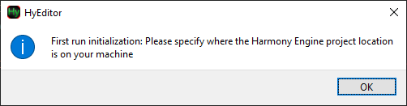
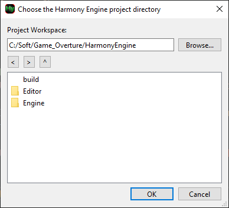

This guide explains how to install the Harmony Game Engine (HyEngine) and prepare your environment. You can optionally compile the HyEditor or download a prebuilt release. All steps assume a Windows or Linux development environment.

## ▶️Prerequites
Before cloning Harmony Engine or building the editor, ensure the following tools are installed:

### C++ Toolchain (IDE)
Visual Studio 2022/2026 is the recommended development environment on Windows: [https://visualstudio.microsoft.com/](https://visualstudio.microsoft.com/)

### Git

The Harmony Git repository is referenced in all game projects and builds from source. Harmony also uses Git submodules for its dependencies, so a Git client is required.

**Windows:**
Download Git for Windows: [https://git-scm.com/download/win](https://git-scm.com/download/win)

**Linux:**
Git is typically installed already. If not:
`sudo apt install git`

### CMake
Harmony Engine uses CMake internally to configure and generate all build files for the engine, editor, and game projects.

1. Download CMake: [https://cmake.org/download/](https://cmake.org/download/)
2. Ensure you select "Add CMake to system PATH" during installation

## ▶️Clone Git repository

Clone the Harmony Engine repository and initialize submodules:
```
git clone https://github.com/GameOverture/HarmonyEngine.git
cd HarmonyEngine
git submodule update --init --recursive
```
Editor and Engine submodules are found in their respective 'vendor' directories.
> Important: Submodules must be initialized or the editor and engine will not build correctly.

## ▶️Get the Editor
You can either:

- Download a pre-built Release, or
- Compile the editor from source

### Option A - Download a pre-built HyEditor Release
Pre-built binaries are available on the project’s GitHub Releases page: [https://github.com/GameOverture/HarmonyEngine/releases/latest](https://github.com/GameOverture/HarmonyEngine/releases/latest)

This requires no additional setup beyond installing Git and CMake.
Simply download the archive, extract it, and run `HyEditor.exe`. 

**You can skip the next section that compiles the editor.**

### Option B - Compile the Editor from source

Compiling HyEditor requires the Qt6 framework.
Download the Qt Online Installer (Open Source):
[https://www.qt.io/download-qt-installer-oss](https://www.qt.io/download-qt-installer-oss)

**During installation:**

- Only Qt 6.9.3 has been fully tested. 
> Everything should be compatible with Qt5, but you will need to modify the CMakeLists.txt and replace Qt6 -> Qt5 references if you really need to use it

- Qt must be built for your compiler. For Visual Studio users:
    - Install Qt with MSVC 2022 64-bit
- You must include:
    - Qt Multimedia (under Additional Libraries)

**Building with CMake:**

You can build using either the CMake GUI or the command-line.

**Using CMake GUI:**

1. Open CMake GUI
2. Set "Where is the source code:" should be the path to cloned Harmony repository: `C:/<path_to_repo>/HarmonyEngine`

3. "Where to build the binaries:" should be the same path + "/build" on the end: `C:/<path_to_repo>/HarmonyEngine/build`

4. Press "Configure" button and confirm creating the build directory
In the next dialog, choose which IDE to generate in first combo box (Visual Studio 2022, Ninja, etc.)
5. Set Qt6_DIR to the Qt CMake directory:
```
-Example-  C:\Qt\6.9.3\msvc2022_64\lib\cmake\Qt6
```
6. Press "Configure" again until all red options disappear
7. Press "Generate" once
8. Press "Open Project" to open the generated solution (.sln) or navigate to the specified `build/` directory

> If using Visual Studio, installing *Qt Visual Studio Tools* extension is recommended for Qt-aware debugging and UI file navigation

## ▶️Running the Editor for the First Time

Whenever HyEditor launches, it checks whether it can find where the Harmony Engine project is located. 

<figure>
  
  <figcaption>If it's the first time running HyEditor, or it can't find Harmony project location.</figcaption>
</figure>

In the next dialog, browse to the location of the Harmony Engine project. You should be looking for the root directory of the Git repository. When you find a valid location, the red error bar will disappear and can you press OK. The folder contents will look something like this:

<figure>
  
  <figcaption>Example of a valid Harmony Engine project location.</figcaption>
</figure>

When you continue, HyEditor will remember this location, and various other editor preferences in the following location:

**WINDOWS** uses the registry: `\HKEY_CURRENT_USER\SOFTWARE\Harmony Engine`

**LINUX** stores in: `~/.config/Harmony Engine/`

> If you ever want to change the Harmony Project location, first close HyEditor. You can delete the old location then reopen HyEditor, or keep the old location and point to a new location by doing **Tools** -> **Change Harmony Location**

## ▶️Uninstalling Harmony Engine

- Remove the editor preferences setting at:

**WINDOWS** uses the registry: `\HKEY_CURRENT_USER\SOFTWARE\Harmony Engine`

**LINUX** stores in: `~/.config/Harmony Engine/`

- Then simply delete the Harmony repository directory and any HyEditor pre-built release you downloaded.


