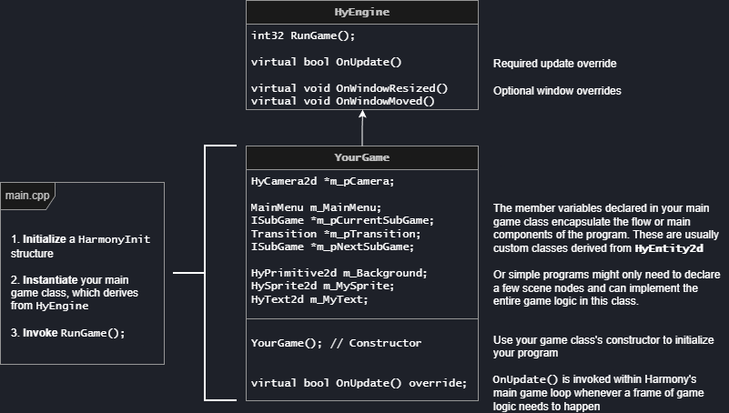

---
title: "Programming Manual"
hide: toc
---

<figure>
  
  <figcaption>How your game application works with HyEngine. All new projects are generated with this basic structure.</figcaption>
</figure>

## Global Engine Utilities

The `HyEngine` base class provides public static methods to access global engine functionality and information.
``` cpp
// Above setup
static bool IsInitialized();
static const HarmonyInit &InitValues();
static std::string DateTime();

// Windows & Cameras
static uint32 NumWindows();
static HyWindow &Window(uint32 uiWindowIndex = 0);

// Scene Management
static float DeltaTime();
static double DeltaTimeD();
static void LoadingStatus(uint32 &uiNumQueuedOut, uint32&uiTotalOut);
static void PauseGame(bool bPause);

// Input Handling
static HyInput &Input();

// Audio System
static HyAudioCore &Audio();

// Diagnostics & Debugging
static HyDiagnostics &Diagnostics();

// Shaders
static HyShaderHandle DefaultShaderHandle(HyType eType);

// Direct Asset Loading
static std::string DataDir();
static HyTextureQuadHandle CreateTexture(std::string sFilePath, HyTextureInfo textureInfo);
static HyAudioHandle CreateAudio(std::string sFilePath, bool bIsStreaming = false, int32 iInstanceLimit = 0, int32 iCategoryId = 0);
```

## Next Steps
More information for the above functions and more can be found in:

→ **[Windows & Cameras](./windows-cameras.md)**  
→ **[Scene Management](./scene/index.md)**  
:material-arrow-right-bottom: [Item Nodes](./scene/item-nodes.md) | [Entities & Physics](./scene/entities.md) | [User Interface](./scene/user-interface.md)  
→ **[Input Handling](./input.md)**  
→ **[Audio System](./audio.md)**  
→ **[Diagnostics & Debugging](./diagnostics.md)**  
→ **[Shaders](./shaders.md)**  
→ **[Direct Asset Loading](./direct-assets.md)**  

