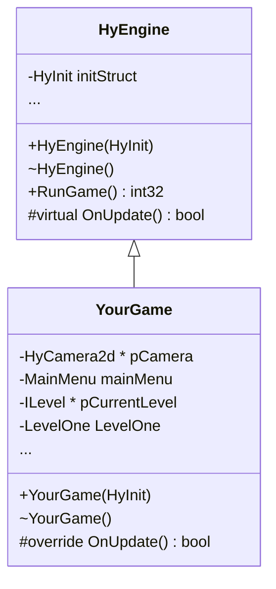
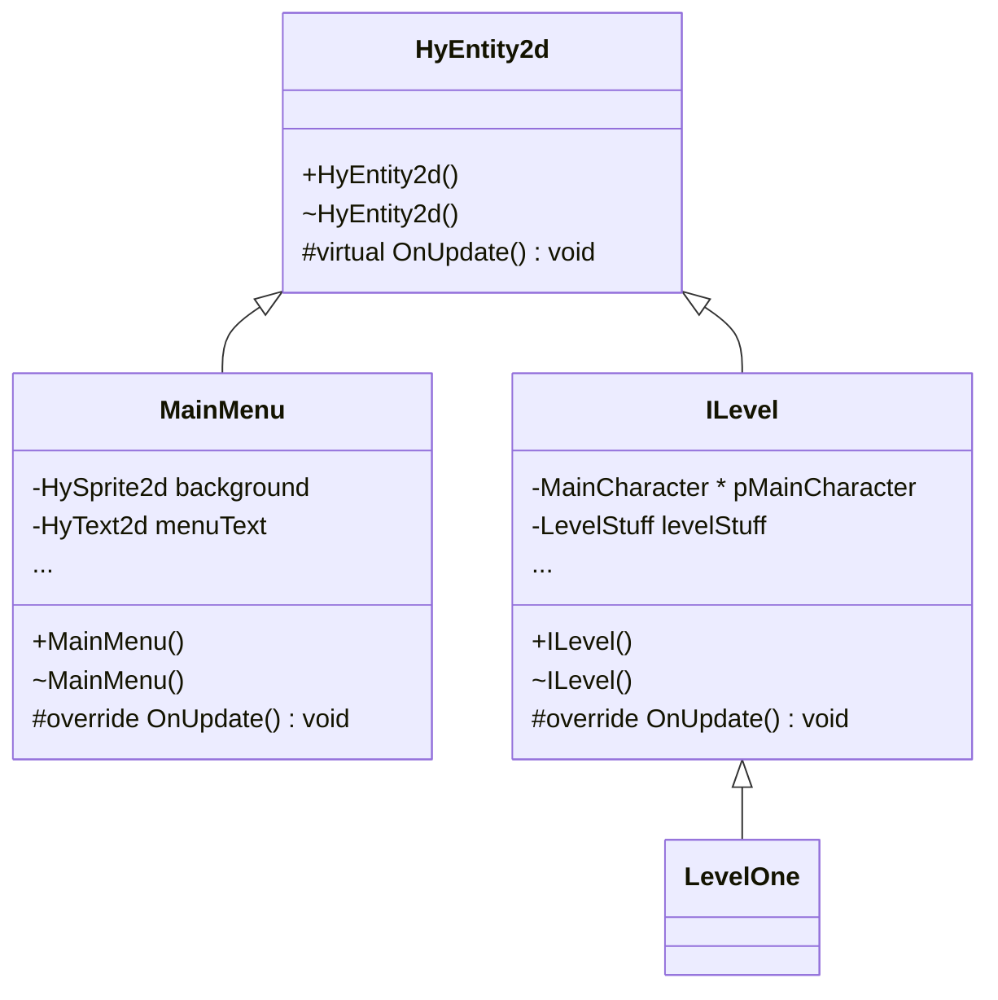

---
title: "Programming Manual"
hide: toc
---

How your game application works with HyEngine. All new projects are generated with this basic structure.

<div class="grid" markdown>



<div markdown>

:fontawesome-solid-file-alt:`main.cpp`

1. Initializes a `HyInit` structure  

2. Instantiate `YourGame` class, which derives from `HyEngine`  

3. Invoke `YourGame::RunGame()` to start the main game loop

---

Use `YourGame` class constructor to initialize your game.  

Override `OnUpdate()` to implement your game's main logic, such as updating the current level or handling menu navigation. `OnUpdate()` is invoked within Harmony's main game loop whenever a frame of game logic needs to happen.

Simple programs might only need to declare a few scene nodes and can implement all logic directly in `OnUpdate()`. More complex games will likely want to create separate classes to encapsulate different game states or levels.  

</div>

</div>

!!! tip annotate "Most code objects derive from `HyEntity2d`"
    The member variables declared in your main game class can encapsulate the flow or main aspects of the program. These are usually custom classes derived from `HyEntity2d`. (1)

1. `HyEntity2d` is a special scene node that can contain other scene nodes like sprites, text, and audio. It also serves as a way to logically group and update objects within the game world.  


## Engine Utilities

The `HyEngine` class (1) provides public static methods to easily access engine functionality and information.
{ .annotate }

1.  `HyEngine` public static methods:
``` cpp
class HyEngine
{
    static HyEngine * sm_pInstance;
    ...

public:
    HyEngine(const HyInit &initStruct);
    ~HyEngine();
    ...
    static bool IsInitialized();
    static const HyInit &InitValues();
    static std::string DateTime();
    static uint32 NumWindows();
    static HyWindow &Window(uint32 uiWindowIndex = 0);
    static float DeltaTime();
    static double DeltaTimeD();
    static void LoadingStatus(uint32 &uiNumQueuedOut, uint32 &uiTotalOut);
    static void PauseGame(bool bPause);
    static HyInput &Input();
    static HyAudioCore &Audio();
    static HyDiagnostics &Diagnostics();
    static HyShaderHandle DefaultShaderHandle(HyType eType);
    static std::string DataDir();
    static HyTextureQuadHandle CreateTexture(std::string sFilePath, HyTextureInfo textureInfo);
    static HyAudioHandle CreateAudio(std::string sFilePath, bool bIsStreaming = false, int32 iInstanceLimit = 0, int32 iCategoryId = 0);
};
```

<div class="grid cards" markdown>

-   [:fontawesome-solid-video-camera:{.hyindicator}ㅤ**Cameras & Windows**](./cameras-windows.md)  
    How to manage your camera viewports and render windows.
    ``` cpp
    std::vector<HyCamera2d *> cameraList;
    for(uint32 i = 0; i < HyEngine::NumWindows(); ++i)
    {
        cameraList.push_back(HyEngine::Window(i).CreateCamera2d());
        glm::vec2 ptCenter(HyEngine::Window(i).GetWidthF(0.5f),
                           HyEngine::Window(i).GetHeightF(0.5f));
        ...
    }
    ```

-   [:material-graph-outline:{.hyindicator}ㅤ**Scene Management**](./scene/index.md) -> [Item Nodes](./scene/item-nodes.md) | [Entities & Physics](./scene/entities.md) | [User Interface](./scene/user-interface.md)  
    The building blocks to make the game.
    ``` cpp
    case STATE_Spinning:
		m_SpinNode.rot.Offset((m_fSpinSpeed * HyEngine::DeltaTime()));
		m_fElapsedTime += HyEngine::DeltaTime();
		if(m_fElapsedTime >= 3.0f)
			m_eState = STATE_PrepStop;
		break;
    case STATE_PrepStop:
    ...
    ```

-   [:material-controller:{.hyindicator}ㅤ**Input Handling**](./input.md)  
    Utilize Input Maps and get player input from various devices.
    ``` cpp
    uint32 uiDPadFlags = 0;
    if(HyEngine::Input().IsActionDown(ARCADESTICK_Up))
        uiDPadFlags |= DPad_Up;
    if(HyEngine::Input().IsActionDown(ARCADESTICK_Down))
        uiDPadFlags |= DPad_Down;
    ...
    if(HyEngine::Input().IsActionReleased(DEBUGKEY_DumpAtlases))
        HyEngine::Diagnostics().DumpAtlasUsage();
    ```

-   [:material-volume-high:{.hyindicator}ㅤ**Audio System**](./audio.md)  
    Manage how `HyAudio2d` audio cues are played back, categories, and settings.
    ``` cpp
    btnVolumeDown.SetText("VOLUME DOWN");
    btnVolumeDown.SetButtonClickedCallback(
      [](HyButton *pBtn)
      {
        float fVolume = HyEngine::Audio().GetGlobalVolume() - 0.05f;
        fVolume = HyMath::Clamp(fVolume, 0.0f, 1.0f);
        HyEngine::Audio().SetGlobalVolume(fVolume);
      });
    ```

-   [:material-bug-outline:{.hyindicator}ㅤ**Diagnostics & Debugging**](./diagnostics.md)  
    Logging, performance profiling, and on-screen diagnostic overlays.
    ``` cpp
    HyEngine::Diagnostics().Init("Prefix", "MyText", 1);
    ...
    if(HyEngine::Input().IsActionReleased(DEBUGKEY_DiagFPS))
    {
        uint32 uiDiagFlags = HyEngine::Diagnostics().GetShowFlags();
        uiDiagFlags ^= HYDIAG_Fps;
        HyEngine::Diagnostics().Show(uiDiagFlags);
    }
    ```

-   [:material-shape-outline:{.hyindicator}ㅤ**Shaders**](./shaders.md)  
    Override built-in shaders on scene nodes to create impressive effects.
    ``` cpp
    pShader = HY_NEW HyShader(HYSHADERPROG_Primitive);
    pShader->SetSourceCode(szVERTEXSHADER_SRC, HYSHADER_Vertex);
    pShader->AddVertexAttribute("attrPos", HyShaderVariable::vec2);
    pShader->AddVertexAttribute("attrUV", HyShaderVariable::vec2);
    pShader->SetSourceCode(szFRAGMENTSHADER_SRC, HYSHADER_Fragment);
    pShader->Finalize();
    ...
    m_PrimitiveBox.SetShader(pShader);
    ```

-   [:material-database-outline:{.hyindicator}ㅤ**Direct Asset Loading**](./direct-assets.md)  
    Load raw images and audio files off disk using scene nodes.
    ``` cpp
    HyTexturedQuad2d *pBoxArt = nullptr;
    pBoxArt = HY_NEW HyTexturedQuad2d("C:/art.png", HyTextureInfo());
    pBoxArt->Load();

    m_AudioTrack.Init("C:/songs/track1.wav", true, 0, 0);
    m_AudioTrack.volume.Set(1.0f);
    m_AudioTrack.Play();
    m_AudioTrack.Load();
    ```

</div>

