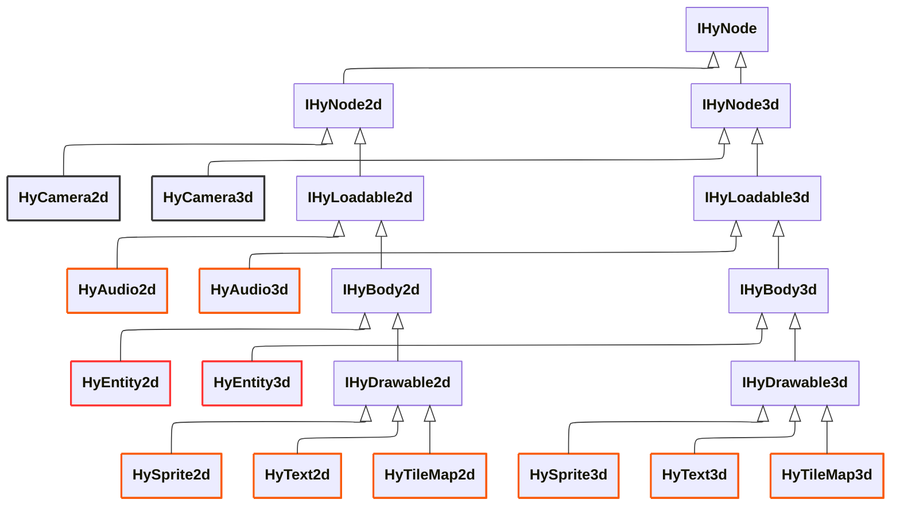
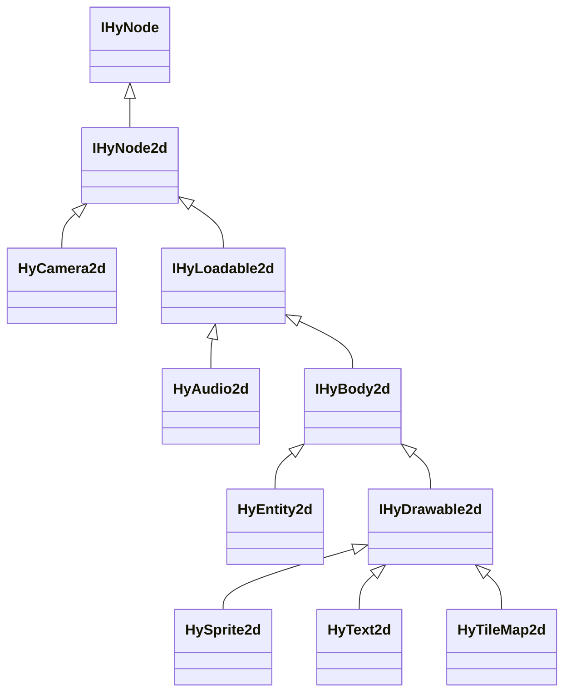

**Item Nodes** are provided C++ classes to create instances of the Editor's [Project Items](../../editor/items/index.md) such as Sprites, Text, TileMaps, etc. These nodes can be thought of as components to assemble [Entities](./entities.md). Every **Item Node** is apart of the same class hierarchy. 

## Instantiating Nodes

Constructing scene nodes follow a pseudo-RAII (Resource Acquisition Is Initialization) pattern. You can allocate nodes whereever without worrying about inserting them into the scene graph. Constructors take a `HyNodePath`(1) and optionally an Entity as the parent node.
{ .annotate }

1.  A `HyNodePath` wraps a string to identify a [Project Item](../../editor/items/index.md) made in **HyEditor**. The string is a case-insensitive path of each prefix and name, delimted with `/`s. For example: `#!cpp "RootPrefix/SubPrefix/ItemName"`

``` cpp
// Dynamically allocate a sprite node without a parent
HySprite2d *pSprite = HY_NEW HySprite2d("GameSprites/Dancer"); // Lives in world space

// Dynamically allocate a sprite node that is a child of `pEntity`
HyEntity2d *pEntity = HY_NEW HyEntity2d();
HySprite2d *pChildSprite = HY_NEW HySprite2d("GameSprites/Dancer", pEntity); // Relative to `pEntity`
```

!!! abstract "Detect memory leaks with `HY_NEW`"
    When using Visual Studio, replace any useage of the `#!cpp new` keyword with `HY_NEW` instead. When the program is shut down gracefully, if there is any dynamically allocated memory that wasn't freed, it will be reported in the Output log. (Note this does not work when using placement `#!cpp new`)

By default all nodes upon construction have:

- Their visibility set to true.
- Their position set to `(0,0)` (or `(0,0,0)` for 3D nodes) relative to either the world origin or their parent entity if provided.
- Their display order set to `0`.

But they will not be considered "loaded"...

The [Project Item](../../editor/items/index.md) used to initialize the Item Node may reference assets such as textures or audio that will need to be loaded. This needs to be explicitly done by calling the `Load()` function (or via an entity's `Load()` function that contains the node).
``` cpp
// Load the sprite's required assets asynchronously
pSprite->Load();

// Or load all child nodes at once contained within an entity
pEntity->Load(); // This will load `pChildSprite`
```

The loading will occur on another thread, and as soon as all the required assets are finished loading, the node will appear (or be able to play audio, etc). You can check if the node is loaded with the `IsLoaded()` function.
``` cpp
if (pSprite->IsLoaded())
    // The sprite is ready to be used

if (pEntity->IsLoaded())
    // All child nodes including `pChildSprite` are loaded and ready to be used
```

Internally, Harmony uses a reference counting system to manage asset loading and unloading, so that multiple nodes using the same asset do not cause redundant loads. 

When a node falls out of scope, is deleted, or has its `Unload()` function called, the reference count for each asset it uses is decremented. When an asset's reference count reaches zero, it is unloaded from memory automatically.

!!! tip "Hot-loading assets"
    You may want to keep certain assets you know will be used frequently loaded in memory by creating a hidden node that uses them. For example, you can create a hidden sprite node that uses a texture you know will be used often. As long as this hidden node remains loaded, the texture will stay in memory, allowing other nodes to use it without incurring load times.

## Transforming Nodes

The `HyAnimFloat` class wraps a `#!cpp float` value that can be set directly, offsetted, or animated over time, typically with tweens (easing functions). `HyAnimVec2` and `HyAnimVec3` classes wrap multiple `HyAnimFloat`'s to represent 2D and 3D vectors.

A node's position, rotation, and scale are represented using these animated classes, and are accessed via the `.pos`, `.rot`, and `.scale` member variables respectively.
``` cpp
pSprite->pos.Set(-100.0f, 0.0f);         // Set position directly
pSprite->pos = glm::vec2(-100.0f, 0.0f); // Set position directly

// Move right and grow larger (linearly) over 2.5 seconds
pSprite->pos.Tween(100.0f, 0.0f, 2.5f);
pSprite->scale.Tween(1.5f, 1.5f, 2.5f);
```

`HyAnimFloat` and `HyAnimVec`'s are very robust and share a similar API. 

## Types

The tabs below give overviews of the various types of built-in **Item Nodes** 

=== " Sprite"  
    Single image or animated sprite. Rendered onto a quad in 2D or 3D space.

=== " TextureQuad"

=== " Text"

=== " Tile Map"

=== " Particles"

=== " Prefab"

=== " Audio"

## Node Hierarchy

Below shows where each **Item Node** (in orange) is located in the hierarchy.



!!! note ""
    For clarity, not all node classes are shown in the diagram above. All the ommitted **Item Nodes** derive either from `IHyDrawable2d` or `IHyDrawable3d`

Each layer in the hierarchy add enough functionality to slot an **Item Node** class into, while keeping shared functionality of the previous layers. This results in clean API across nodes, reusable code, and a compact memory footprint.

<div class="grid" markdown>




Base class `IHyNode` for all scene nodes. It keeps track of its type, whether it's visible, and whether it updates during a [Game Pause](./index.md#pausing-the-game).  
2D or 3D

</div>
