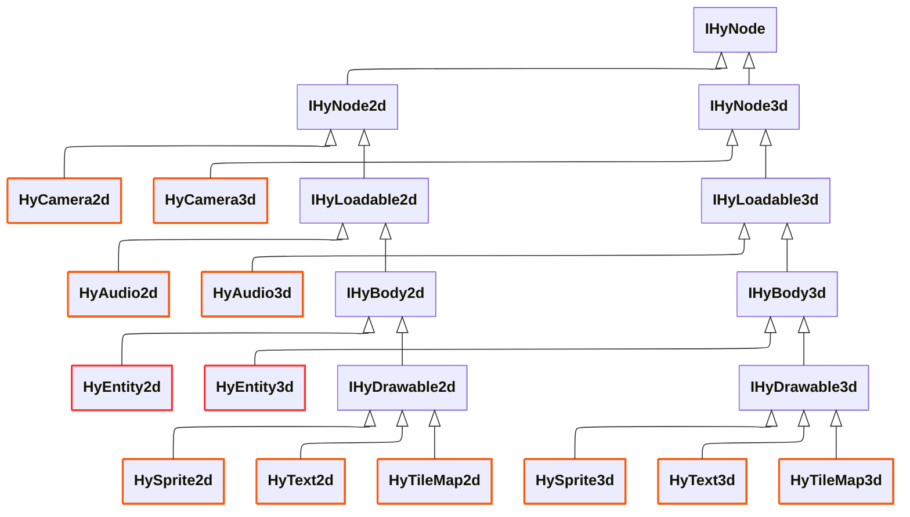
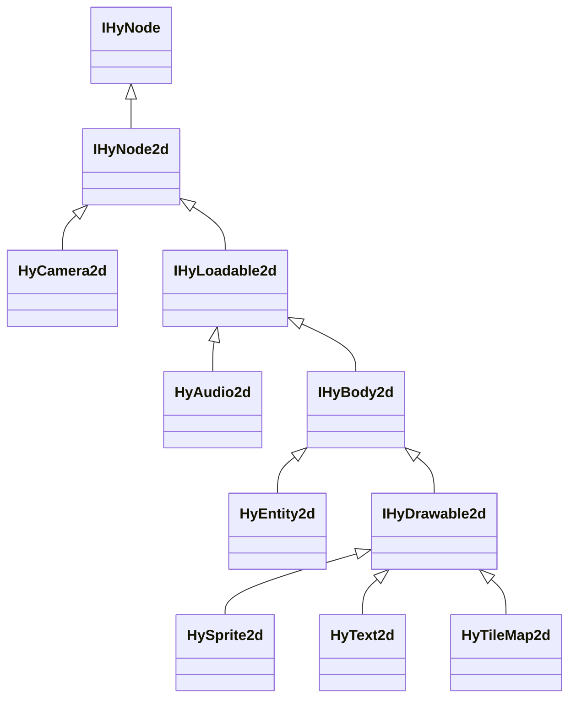

**Item Nodes** are provided C++ classes to create instances of the Editor's [Project Items](../../editor/items/index.md) such as Sprites, Text, TileMaps, etc. These nodes can be thought of as components to assemble [Entities](./entities.md). Every **Item Node** is a part of the same class hierarchy. 

## Node Hierarchy

Below shows where each **Item Node** (in orange) is located in the hierarchy.



!!! note ""
    For clarity, not all node classes are shown in the diagram above. All the ommitted **Item Nodes** derive either from `IHyDrawable2d` or `IHyDrawable3d`

For each layer in the hierarchy:

<div class="grid" markdown>




Base class `IHyNode` for all scene nodes. It keeps track of its type, whether it's visible, and whether it updates during a [Game Pause](./index.md#pausing-the-game).  
2D or 3D

</div>

## Types

The basic node types you can instantiate correspond to the different types of [Project Items](../../editor/items/index.md) you can create in the HyEditor. These include:

=== " Sprite"

=== " Tile Map"

=== " Text"

=== " Particle Effects"

=== " Prefab"

=== " Audio"

## Instantiating Nodes

Constructing scene nodes follow a pseudo-RAII (Resource Acquisition Is Initialization) pattern. You can allocate nodes whereever without worrying about inserting them into the scene graph. Constructors take a `HyNodePath`(1) and optionally an Entity as the parent node.
{ .annotate }

1.  A `HyNodePath` wraps a string to identify a [Project Item](../../editor/items/index.md) made in **HyEditor**. The string is a case-insensitive path of each prefix and name, delimted with `/`s. For example: `#!cpp "RootPrefix/SubPrefix/ItemName"`

``` cpp
// Dynamically allocate a sprite node without a parent
HySprite2d *pSprite = HY_NEW HySprite2d("GameSprites/Dancer");

// Dynamically allocate a sprite node that is a child of `pEntity`
HyEntity2d *pEntity = HY_NEW HyEntity2d();
HySprite2d *pChildSprite = HY_NEW HySprite2d("GameSprites/Dancer", pEntity);
```

The [Project Item](../../editor/items/index.md) used to initialize the Item Nodes may reference assets such as textures or audio that will need to be loaded. Construction alone does not initiate any loading, and needs to be explicitly done by calling the `Load()` function (or via an entity's `Load()` function that contains the node).
``` cpp
// Load the sprite's required assets into memory
pSprite->Load();

// Or load all child nodes contained within an entity
pEntity->Load(); // This will load `pChildSprite`
```

By default all nodes have their visibility set to true.

You don't need to concern yourself with what assets are required to load for the node. This is done automatically, and will internally create a reference count for each required asset. Explicitly calling `Unload()`, deleting the node or having it fall out of scope will automatically decrement the reference count internally. Whenever any asset's reference count reaches zero, it will be unloaded from memory.


## Transforming Nodes
